<picture>
  <source media="(prefers-color-scheme: dark)" srcset="./dark.svg">
  <source media="(prefers-color-scheme: light)" srcset="./light.svg">
  
</picture>

<h1 align="center">Hi 👋, I'm Aյɑվ վɑժɑѵ</h1>

  Software Developer • AI & Automation Explorer • Cybersecurity Enthusiast

  <a href="https://github.com/its-ajayyadav">GitHub</a>

## About me

- 📍 Based in India
- 💻 Working with Python and JavaScript
- 🤖 Exploring AI and automation
- 🔐 Interested in cybersecurity
- 🌱 Building and learning in public

## Skills

  

## GitHub stats

  

